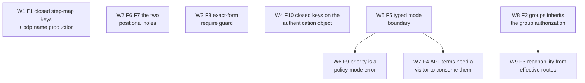

# fix(apl): close the ten holes the apl_cleanup review found

## Summary

Nine units in three phases, one phase per crate, so no unit spans a crate
boundary and every commit builds. Phase A closes three parser holes that are
local to `ppe-apl-core` and depend on nothing. Phase B closes four config-model
holes in `ppe-core`. Phase C closes the two visitor holes in `ppe-apl-runtime`,
which have to land in order because the second one counts the routes the first
one creates.

Five of the ten findings are fail-open: a document says what it wants enforced,
the load accepts it, and nothing enforces it. Those are W5 through W9. The other
five are acceptance holes where a typo or a wrong spelling compiles into
something the author did not write.

---

## Problem Frame

`8d2a62c` landed the grammar document and the closed key model. Reading the
implementation back against both turns up ten places where the two disagree. The
disagreements are not random: eight of them are the same shape, a check that was
written at one boundary and not at the sibling boundary that reaches the same
state.

- The step-map key set is closed in the grammar and open in the parser (F1).
- `groups:` desugars to tags for authentication and not for authorization (F2).
- Reachability is recorded when a layer compiles, not when a route inherits it
  (F3).
- APL terms are accepted by the key model and consumed only by a visitor, with
  no check that one is registered (F4).
- The mode boundary is enforced on raw YAML and not on the typed model the same
  public API accepts (F5).
- The positional guard the grammar documents was written for stage position and
  not rule position (F6), and for the public pipeline entry point and not the
  block compile sites (F7).
- The `require` guard tests a text prefix where the grammar restricts a whole
  predicate (F8).
- `conditions:` is a policy-mode error and `priority:` beside it is not, on a
  rationale that APL dispatch does not support (F9).
- The authentication step map has a closed key set and the object that holds it
  does not (F10).

Each finding was confirmed against the code before being planned. Six were
reproduced with throwaway probes driving the real entry points; the probes were
removed after the run. The verification notes below record what each probe
printed, because two of the findings (F2 and F5a) are only convincing with the
observed contrast in hand.

---

## Verification notes

Confirmed at `8d2a62c`, the tip of `feat/apl_cleanup` before this work; every
file and line anchor below is that commit's.

| # | How confirmed | Observed |
|---|---|---|
| F1 | probe, `parse_step` | `pdp(workload):` gives `Custom("pdp")` with args `"workload"`; `whens:` with a map body gives `Custom("whens")` |
| F2 | probe, `load_config_yaml` + `annotate_route` | group deny via `meta.tags` installs a pre handler; the same deny via `groups:` installs none |
| F3 | probe, `load_config_yaml` | orphan `groups.hr` naming `audit-log` loads clean, and no route carries the tag |
| F4 | probe, `load_config_yaml` | route `authorization:` with an unconditional `deny('always')` loads with no visitor; 0 route annotations |
| F5 | probe, `validate_config` | policy-mode route activation list accepted, `resolve_plugins_for_entity` returns 0; policy-mode `conditions:` accepted; hook-mode `routes:` accepted |
| F6 | probe, `parse_rule` | `result.x \| redact` compiles to `Or([IsTrue result.x, IsTrue redact])` with default deny |
| F7 | probe, `compile_test_route` | `args: { value: "" }` compiles to one no-op `FieldRule` |
| F8 | probe, `parse_rule` | `require(a) & b: allow` rejected, `a & require(b): allow` accepted |
| F9 | read | `evaluate_effects` walks document order (`evaluator.rs:299-322`), `Effect::Plugin` invokes one name (`:483-486`), `cmf_invoker.rs:405-412` passes `slice::from_ref`, and no identity path reads `priority` |
| F10 | probe, `RouteEntry` deserialize | `replace_inherted: true` beside `steps: [jwt]` loads with `replace_inherited == false` |

---

## Dependency graph

Phase A is W1-W3, B is W4-W7, C is W8-W9. Phases A and B are independent of each
other and of C; run them in whatever order suits, but keep each phase's internal
order.

---

## Phase A: parser closure (`ppe-apl-core`)

- W1. **`pdp(name)` is its own production, and the step-map key set closes**

**Fixes:** F1 (High)

**Goal:** `pdp(workload):` resolves the custom dialect `workload`. A map-bodied
step key outside the closed set is a load error naming the key.

**Files:**
- Modify: `crates/ppe-apl-core/src/parser.rs` (`parse_step_map`, `:1673-1712`)
- Modify: `crates/ppe-apl-core/src/parser.rs` (`extract_pdp_body`, `:2414-2444`,
  if the `pdp(name)` body needs its own args path)
- Test: `crates/ppe-apl-core/tests/conformance/` (a new `step_maps.rs` case set,
  or the nearest existing file, added to the existing harness rather than a new
  test binary)

**Approach:**
- Split the key handling into three productions instead of one fallback:
  `pdp(name)` constructs `PdpDialect::Custom(name)`; a bare or parenthesized
  known dialect keeps today's behavior; anything else is an error naming the
  closed set.
- `pdp(name)` takes its args from the body map, the way `cedar:` does, because
  the paren content is the dialect name and not a call signature. That is the
  only shape available: a custom resolver that wants a path writes it as a body
  field. Say so in the grammar if it is not already implied by `pdp(name):`
  appearing under **Step maps** rather than under **PDP calls**.
- Require the closing paren to terminate the key. `pdp(workload` already errors
  on the missing `)`; `pdp(workload) x:` must error too.
- The closure applies to **map-bodied** keys only. A sequence-bodied key is a
  predicate by grammar (`parse_shorthand_multi_effect`, `:1621-1635`), so
  `whens: [deny]` stays a legal predicate on a truthy attribute named `whens`
  and `whens: { on_deny: [...] }` becomes the error. State that boundary in the
  grammar's **Step maps** note, which currently reads as though `whens:` is
  always an error.

**Test scenarios:**
- `pdp(workload):` compiles to `Custom("workload")`, and a resolver registered
  for `workload` is the one the dialect matches.
- `pdp():` and `pdp(workload` are load errors.
- `whens:` with a map body is a load error naming the key and the accepted set.
- Every built-in dialect still parses in both spellings (`cedar:`,
  `opa("hr/deny")`), and `delegate:`, `restrict:`, `sequential:`, `parallel:`,
  `when:`/`do:` are untouched.
- `whens: [deny]` still parses as a predicate shorthand.

**Verification:** `cargo check -p praxis-policy-apl-core` then
`cargo nextest run -p praxis-policy-apl-core`. No in-repo config writes
`pdp(...)`, so the migration cost is tests only.

---

- W2. **The two positional holes the grammar already documents**

**Fixes:** F6, F7 (Medium)

**Goal:** `result.x | redact` in rule position is a load error naming effect
position. A declared field entry whose value compiles to no stages is a load
error.

**Files:**
- Modify: `crates/ppe-apl-core/src/parser.rs` (`parse_rule`, `:771-846`)
- Modify: `crates/ppe-apl-core/src/parser.rs` (`compile_apl_blocks`,
  `:3023-3043`)
- Test: `crates/ppe-apl-core/tests/conformance/positional.rs`

**Approach:**
- F6's guard has to be narrow, because `result.x | result.y: deny` is a **legal**
  disjunction of two truthy attributes and must keep compiling. The
  discriminator is not the `args.`/`result.` head on its own: it is that head
  plus at least one `|` segment that is a recognized stage verb rather than an
  attribute path. Reuse the stage-verb table `parse_pipeline` already dispatches
  on so the two cannot drift.
- Emit the diagnostic before `parse_predicate` runs, so the message names effect
  position rather than reporting a predicate that parsed fine.
- F7 belongs at the two `parse_pipeline` call sites in `compile_apl_blocks`, not
  inside `parse_pipeline`. The public entry point keeps answering an empty input
  with an empty pipeline, which
  `an_entirely_empty_chain_is_an_empty_pipeline` pins and which a host relies on
  for a possibly-absent field value. The block compile site is the position
  where the author named a field and then left its chain empty.
- Name the field in F7's message (`args.value`, `result.ssn`), matching the
  `source` path the sibling errors already carry.

**Test scenarios:**
- `result.x | redact` and `args.y | mask(4)` in rule position are errors naming
  effect position.
- `result.x | result.y: deny` still compiles to a disjunction. This is the
  regression the narrow guard exists for; without the case the guard will be
  widened by a later reader.
- `args: { value: "" }` and `result: { ssn: "  " }` are load errors naming the
  field.
- `parse_pipeline("")` and `parse_pipeline("   ")` still return an empty
  pipeline with no error.

**Verification:** `cargo check -p praxis-policy-apl-core` then
`cargo nextest run -p praxis-policy-apl-core`.

---

- W3. **The `require` guard matches an exact call, not a text prefix**

**Fixes:** F8 (Medium)

**Goal:** `require(a) & b: allow` loads. `require(a): allow` and
`require(a, b): allow` stay errors.

**Files:**
- Modify: `crates/ppe-apl-core/src/parser.rs` (`is_require_form`, `:885-889`)
- Test: `crates/ppe-apl-core/tests/conformance/` (the file that already covers
  the `require` rule shape)

**Approach:**
- Require complete consumption: the call is the exact outer expression only when
  its matching close paren is the last non-space character of the predicate half.
  `extract_call_args` already finds the outermost matching parens, so the check
  becomes "the call spans the whole trimmed predicate".
- Keep the check textual. The function's own doc comment argues for textual, and
  the argument survives: the question is which of two shapes the predicate half
  is, and complete consumption answers it without a parse. Note in the comment
  that a prefix test is what made the guard asymmetric, so the next reader does
  not simplify it back.

**Test scenarios:**
- `require(a): allow` and `require(a, b): allow` are still errors, and the
  message still names the deny-only restriction.
- `require(a) & b: allow`, `a & require(b): allow`, and
  `require(a) | require(b): allow` all load, which is the composition
  `docs/apl-grammar.md:193-200` documents as legal.
- `require(a) : deny` with padding around the colon is unaffected.

**Verification:** `cargo check -p praxis-policy-apl-core` then
`cargo nextest run -p praxis-policy-apl-core`. Full `make ci` at the end of
Phase A, per the three-unit gate.

---

## Phase B: the config boundary (`ppe-core`)

- W4. **The `authentication:` object carries a closed key set**

**Fixes:** F10 (Medium)

**Goal:** `replace_inherted: true` is a load error rather than a silent
`replace_inherited == false`.

**Files:**
- Modify: `crates/ppe-core/src/config.rs` (`deserialize_route_identity`'s
  `Mapping` branch, `:452-474`)
- Modify: `crates/ppe-core/src/config.rs` (a new `ConfigScope::Authentication`
  beside `AuthenticationStep`, its key table, `ConfigScope::ALL` and `label`)
- Test: `crates/ppe-core/src/config.rs` tests, beside the existing
  authentication-step key cases

**Approach:**
- Add the scope to the key model rather than hand-rolling a key list, so the one
  authority for accepted keys stays the authority. `ConfigScope::ALL` grows from
  7 to 8; check whether any test walks `ALL` and asserts a count.
- Validate before extracting either value, so a document with both a typo and a
  bad `steps:` shape reports the typo. Both `authentication:` shapes stay
  accepted; only the object form gains the check, since the list form has no
  keys.
- Enforced by the deserializer, not by `parse_config`, matching how
  `AuthenticationStep` is enforced (`:519-524`). Say so in the scope's doc so a
  reader does not look for a `reject_unknown_*` call that does not exist.

**Test scenarios:**
- `replace_inherted: true` with valid `steps:` is a load error naming the key and
  the accepted set.
- `steps:` alone, and `steps:` with `replace_inherited:`, still load.
- The list form still loads and still means `replace_inherited: false`.
- A typo inside a step map still reports at step scope, not object scope.

**Verification:** `cargo check -p praxis-policy-core` then
`cargo nextest run -p praxis-policy-core --lib`.

---

- W5. **The typed load boundary enforces the mode split**

**Fixes:** F5 (High)

**Goal:** `PolicyEngine::load_config(PolicyConfig)` and
`PolicyEngine::from_config` reject what `load_config_yaml` rejects.

**Files:**
- Modify: `crates/ppe-core/src/config.rs` (typed equivalents of
  `reject_activation_lists_in_policy_mode` and
  `reject_plugin_conditions_in_policy_mode`, and of
  `reject_policy_keys_in_hook_mode`)
- Modify: `crates/ppe-core/src/config.rs` (`validate_config`'s doc comment,
  `:1878-1890`, which claims the walk guards host-built activation lists and
  does not)
- Modify: `crates/ppe-core/src/engine.rs` (`normalize_and_validate`, `:439-447`)
- Test: `crates/ppe-core/src/config.rs` and
  `crates/ppe-core/tests/` for the three shapes through the typed entry point

**Approach:**
- Put the three checks in `normalize_and_validate`, which is the one function all
  three load entry points share (`engine.rs:811`, `:962`, `:1097`). That is what
  makes the typed and YAML boundaries agree by construction rather than by two
  parallel check lists.
- The raw-YAML checks stay. They name YAML paths (`routes[0]`,
  `global.defaults.tool`) that a typed check cannot reconstruct, and a document
  should get the better message. The typed checks are the backstop for the host
  that never had YAML.
- A non-empty `RouteEntry.plugins` in policy mode is unambiguously a host-built
  activation list: the override *mapping* deserializes to an empty `Vec`
  (`:1086`), so YAML cannot produce a non-empty one that the raw check did not
  already refuse. Same for `PolicyGroup.plugins`.
- Order matters: run after `fold_groups_into_bundles`, so the bundle walk sees
  top-level `groups:` folded in, exactly as `validate_config` already does.
- `from_config` passes `has_visitor: false` and cannot do otherwise, since no
  visitor can be registered on an engine that does not exist yet. Leave that
  alone; W7 is where the consequence is handled.

**Test scenarios:**
- A `PolicyConfig` built in Rust with a policy-mode route activation list is
  rejected, and the message names `run(name)` the way the YAML message does.
- The same list in hook mode still loads, and `resolve_plugins_for_entity` still
  returns it.
- A policy-mode plugin carrying `conditions:` is rejected through
  `load_config`, `from_config`, and `load_config_yaml`.
- A hook-mode `PolicyConfig` carrying routes, `groups:`, `global.bundles`, or
  `global.defaults` is rejected through the typed path.
- A plugin override *mapping* on a policy-mode route still loads. This is the
  shape that shares the key and must not be caught.

**Verification:** `cargo check -p praxis-policy-core` then
`cargo nextest run -p praxis-policy-core`.

---

- W6. **`priority:` is a policy-mode load error**

**Fixes:** F9 (Medium)

**Goal:** U8's requirement holds: neither `conditions:` nor `priority:` is
accepted in policy mode.

**Dependencies:** W5

**Files:**
- Modify: `crates/ppe-core/src/config.rs`
  (`reject_plugin_conditions_in_policy_mode`, `:1716-1745`, renamed to cover
  both keys, and its doc comment, which currently asserts the opposite)
- Modify: `crates/ppe-core/src/config.rs` (replace the test
  `a_plugin_priority_loads_in_policy_mode`, `:3677-3694`, which codifies the
  divergence)
- Modify: `crates/ppe-core/src/plugin.rs` (`priority`'s doc, `:216-218`, and the
  `conditions` doc at `:245-247` that repeats the claim)
- Migrate: surveyed, 22 YAML-shaped `priority:` lines, of which **8 are already
  `dispatch: hooks` and need no change**. The 14 that must move:
  - 11 where `priority:` is incidental, set beside `mode: sequential` in a test
    about something else (init counts, host services, `on_error`, cache
    population, a rejected load). Delete the line; no assertion moves.
    `config.rs:2865`; `engine.rs:3507`, `:3512`, `:5632`, `:5694`, `:5699`,
    `:6166`, `:6461`, `:6624`, `:6745`.
  - 1 that codifies the divergence, `config.rs:3690`
    (`a_plugin_priority_loads_in_policy_mode`). Replaced by the rejection test.
  - 3 in `tests/identity_route_e2e.rs:265`, `:269`, `:273`
    (`route_identity_block_dispatches_in_declared_order`). See the note below:
    this test loses half its story and cannot be moved to hook mode.
- Migrate: `crates/ppe-core/tests/fixtures/legacy-policy-document.yaml`, 7
  `priority:` declarations under `dispatch: policy` (`:19`), read by
  `crates/ppe-core/tests/wire_compatibility.rs`. See the note below.
- Modify: `CHANGELOG.md`

**Approach:**
- Reject a **declared** `priority:` on the raw path, where declared is
  unambiguous (`plugin.get("priority").is_some()`).
- Do **not** add a typed equivalent, and say why in the comment: the field is
  `#[serde(default = "default_priority")]`, so a typed check cannot distinguish
  a host that set the default from one that set nothing, and rejecting the
  default value would refuse every `PluginConfig` literal in the workspace. W5's
  three checks have no such ambiguity, which is why they get typed equivalents
  and this one does not. This is a real, bounded gap in the enforcement, not an
  oversight; record it as such.
- The message should say what the reviewer established, since that is the part
  an operator cannot see: effects run in document order, a `run(name)` step
  invokes one named entry, and the runtime hands the executor a one-entry slice,
  so there is no pair of policy-selected plugins for the registry to order.
  Point at `dispatch: hooks` for a config that wants priority ordering.
- Sweep the migration before landing the rejection, in the same commit, the way
  U8 did for its two examples. Choose `dispatch: hooks` where the test is about
  priority ordering, and drop the key where priority is incidental.

**Two consequences the sweep cannot avoid.** Both are costs of the fix, not
oversights, and both belong in the commit message.

- `route_identity_block_dispatches_in_declared_order` sets priority 10/20/30 in
  reverse and declares the route's `authentication:` steps in a different order,
  to prove that identity resolution follows declaration and not priority. That
  contrast becomes unexpressible: the test cannot move to `dispatch: hooks`,
  because `routes:` is itself a hook-mode load error, and it cannot keep the
  priorities. It keeps its declaration-order assertion and loses the
  "not priority" half. That is the right outcome, since in policy mode there is
  no longer a priority for declaration order to beat, but the comment must be
  rewritten to say so rather than left claiming a contrast the document can no
  longer set up.
- The wire-compatibility fixture is the document class this change breaks, which
  is uncomfortable for a fixture whose job is to keep loading. There is
  precedent and it is the right one: `wire_compatibility.rs`'s own header
  records that the phase spelling was already moved deliberately and retired in
  the CHANGELOG. `priority:` becomes the second such surface, recorded the same
  way. The fixture is also the best evidence for the fix: its `audit-log` entry
  reads `priority: 90  # fires AFTER policy / delegate so the record reflects
  the final decision`, which is precisely the ordering an operator expects from
  the key and precisely what policy dispatch does not do. The false belief is
  not hypothetical; it is checked in.

**Test scenarios:**
- A policy-mode plugin declaring `priority:` fails the load, and the message
  names `priority`, `dispatch: policy`, the plugin, and `dispatch: hooks`.
- A document that declares no `dispatch:` at all is checked as policy mode.
  `declared_dispatch_mode` returns the default for an absent key (`:1599-1608`),
  so the rejection reaches a document that never mentions dispatch, which is
  most of the sweep.
- A hook-mode plugin declaring `priority:` still loads and still sorts by it.
- A policy-mode plugin declaring neither key still loads.
- The migrated fixture still loads and still pins every `kind:` string, plugin
  name, route key and violation code.

**Verification:** `cargo check -p praxis-policy-core` then
`cargo nextest run -p praxis-policy-core`, then the full workspace, since the
sweep touches four files and a shared fixture. Full `make ci` here, per the
three-unit gate.

---

- W7. **An APL term needs a visitor that can consume it**

**Fixes:** F4 (High)

**Goal:** A policy-mode document declaring `authorization:`, `args:` or
`result:` with no registered visitor fails the load naming `dispatch: hooks`,
rather than loading and enforcing nothing.

**Dependencies:** W5

**Files:**
- Modify: `crates/ppe-core/src/engine.rs` (`load_config_yaml`, before the
  `self.load_config(policy_config)?` call at `:973`)
- Modify: `crates/ppe-core/src/config.rs` (the new check, driven off
  `ConfigScope::keys()` filtered to `KeyRole::AplTerm`)
- Modify: `crates/ppe-core/src/config.rs`
  (`reject_policy_mode_with_nothing_to_dispatch`'s doc, `:1749-1767`, which
  describes itself as the only visitor-less protection)
- Test: `crates/ppe-apl-runtime/tests/dispatch_mode_e2e.rs` for the case that
  must still load with a visitor, and `crates/ppe-core/tests/` for the refusal
- Modify: `CHANGELOG.md`

**Approach:**
- Drive the check off the key model: walk every section scope, collect the keys
  whose `role` is `KeyRole::AplTerm`, and report the ones the document carries.
  A future APL term then cannot be added to the tables without this check seeing
  it, which is the property the closed key model exists for.
- Run it **before** `load_config`, not after. The reviewer's point is that the
  existing visitor walk runs after the snapshot is installed and a visitor
  failure is documented as not rolled back, so a check that runs late leaves the
  config live. Rolling back a failed visitor walk is a separate, larger question
  and is explicitly out of scope here.
- Do not touch `parse_config`. It returns a `PolicyConfig` and installs nothing,
  so an APL term there is a parse of a document that may later be loaded into an
  engine that does have a visitor. Keeping it pure is also what bounds this
  unit's migration: the 18 `authorization:` sites in `ppe-core` are mostly
  `parse_config` calls and stay as they are.
- `from_config` cannot register a visitor, but it takes a typed `PolicyConfig`
  that has already dropped every APL body, so there is nothing left to detect.
  Note that in the check's doc, because it is the obvious next question.
- The message names `dispatch: hooks` as U9 requires, and names the term and its
  section path so an operator knows which block is being refused.

**Test scenarios:**
- A route-level `authorization:` with no visitor fails, naming the term, the
  route, and `dispatch: hooks`. The probe's document is the case: a plugin, a
  route, and an unconditional `deny('always')` that today loads and enforces
  nothing.
- The same for `global.authorization:`, `groups.<name>.authorization:`,
  `global.defaults.<entity>.authorization:`, `args:` and `result:`.
- The same documents load with the APL visitor registered.
- A hook-mode document, and a policy-mode document with no APL term, still load
  with no visitor.
- A document whose only APL-shaped key is a registered visitor's own
  `extra_route_keys()` entry is unaffected.

**Verification:** `cargo check -p praxis-policy-core -p praxis-policy-apl-runtime`
then `cargo nextest run -p praxis-policy-core -p praxis-policy-apl-runtime`.

---

## Phase C: the visitor (`ppe-apl-runtime`)

- W8. **`groups:` inherits the group's authorization, not just its
  authentication**

**Fixes:** F2 (High)

**Goal:** `groups: hr` and `meta: { tags: [hr] }` resolve identically for
authorization, which is what `RouteEntry.groups` documents and what the probe
shows they do not.

**Files:**
- Modify: `crates/ppe-core/src/config.rs` (make the ordered tag stream public:
  either `route_static_tags` itself, `:2261-2268`, or a public wrapper returning
  the names, since `impl Iterator` in a public signature is a semver
  consideration)
- Modify: `crates/ppe-core/src/config.rs` (`route_static_tags`'s doc, which
  records the gap as "not closed here", and `RouteEntry.groups`'s doc)
- Modify: `crates/ppe-apl-runtime/src/visitor.rs` (`visit_route`'s tag list,
  `:915-920`, and its use at `:963-966`)
- Test: `crates/ppe-apl-runtime/tests/` beside the existing bundle-layering
  cases
- Modify: `CHANGELOG.md`

**Approach:**
- One reader becomes two, which is the point: both chains then walk the same
  ordered stream, `meta.tags` in declaration order followed by `groups:` in
  declaration order. `authentication_layers`'s doc at `:2540-2556` already
  argues that the two chains have to agree and that a key honored by half is the
  fault; this makes the argument true.
- Order is load-bearing beyond dedup: it is what makes `replace_inherited:` well
  defined at bundle scope, per that same doc. So export the stream, not a set.
- Decide whether a name appearing in both spellings stacks its layer twice.
  `apply_layer` appends steps, so a duplicate would run the group's steps twice.
  Dedupe while preserving first-seen order.
- No in-repo migration. All 16 route-level `groups:` sites are in `ppe-core`,
  which registers no APL visitor, so this changes no existing test's behavior
  and the unit is new tests plus the fix.

**Test scenarios:**
- The probe's contrast becomes a test: a group declaring
  `authorization.pre_invocation: ["deny('group')"]` and one route joining it,
  once through `meta.tags` and once through `groups:`, install the same handler
  and reach the same decision.
- A route naming the same group in both spellings runs the group's steps once.
- A route joining two groups runs them in document order, and
  `replace_inherited:` at bundle scope still resolves the way the authentication
  chain resolves it.
- A group's `args:`/`result:` pipelines reach a route that joined via `groups:`.
- An unknown name under `groups:` still fails at load (`config.rs:2016-2024`),
  and `meta.tags` stays permissive.

**Verification:** `cargo check -p praxis-policy-core -p praxis-policy-apl-runtime`
then `cargo nextest run -p praxis-policy-apl-runtime`.

---

- W9. **Reachability is accumulated from effective routes**

**Fixes:** F3 (High)

**Goal:** A plugin named only by a layer no installed route inherits fails the
reachability check, because it cannot run.

**Dependencies:** W8. The set of routes that inherit a bundle changes in W8, and
this unit counts exactly that set. Landing them in the other order would make
this unit's tests wrong and then silently right.

**Files:**
- Modify: `crates/ppe-apl-runtime/src/visitor.rs` (drop the
  `record_reached_layer_names` calls from `visit_default`, `:856`, and
  `visit_policy_bundle`, `:882`)
- Modify: `crates/ppe-apl-runtime/src/visitor.rs` (`visit_route`: record from the
  effective route at the point a handler installs, `:1066-1120`)
- Modify: `crates/ppe-apl-runtime/src/visitor.rs`
  (`record_reached_layer_names`'s doc, `:532-558`, whose "reachability cannot
  wait for a route" argument is the one being narrowed)
- Modify: `crates/ppe-apl-runtime/tests/dispatch_mode_e2e.rs`
  (`a_bundle_step_reaches_a_plugin_with_no_routes_declared`, `:236-252`, and its
  entity-default sibling above it, both of which currently bless the fail-open)
- Modify: `CHANGELOG.md`

**Approach:**
- Keep exactly one exception, `global:`, and keep it for the reason the doc
  gives: `visit_global` installs an entity-less HTTP catch-all that governs
  requests resolving no route. That install is already gated on the layer
  declaring a phase (`:766-777`), and a layer naming a plugin declares one, so
  the existing unconditional record in `visit_global` is already effectively
  gated and can stay as it is.
- `visit_default` and `visit_policy_bundle` install nothing. They populate
  `default_layers` and `tag_layers`, which only `visit_route` reads. So the
  record moves to where the effective route is known, after the layers stack and
  under the same `installs_pre || installs_post` condition the handler install
  uses.
- Ordering already works: the engine walks global, then defaults, then bundles,
  then routes (`engine.rs:900-906`), so every layer a route could inherit is in
  state before `visit_route` runs.
- Rewrite the two tests rather than delete them. Each becomes a pair: the layer
  with a route that inherits it loads, and the same layer with no such route
  fails naming the plugin. That is the assertion the originals were reaching for.

**Test scenarios:**
- A group naming a plugin with no route carrying its tag or naming it under
  `groups:` fails the load naming the plugin.
- The same group with one route joining it loads, in both membership spellings.
  This is the case W8 makes possible and the reason for the dependency.
- An entity default naming a plugin with no route of that entity type fails; with
  one route of that type, it loads.
- A `global:` step naming a plugin with no routes at all still loads. This is the
  exception, and without the case the next reader will remove it.
- A `delegate(...)` in a `global:` block with no route under it still loads,
  which is the regression `record_reached_layer_names`'s doc records.
- A route-scope step naming a plugin is unaffected.

**Verification:** `cargo check -p praxis-policy-apl-runtime` then
`cargo nextest run -p praxis-policy-apl-runtime`. Full `make ci` at the end, per
the three-unit gate.

---

## Cross-cutting notes

**Documentation.** Four findings are the implementation disagreeing with
`docs/apl-grammar.md`, and three of those are fixed by changing the
implementation. Two need the document to move as well: W1 should state that the
step-map closure is on map-bodied keys, and that a `pdp(name)` body carries its
own args; W6 should record that `priority:` is a policy-mode error, next to
`conditions:`.

**CHANGELOG.** W6, W7, W8 and W9 are breaking: a document that loads today stops
loading, or a route starts enforcing policy it did not enforce. W6's and W7's
entries need the migration in them (`dispatch: hooks`, or register a visitor).
W8's entry should say plainly that a route joining a group through `groups:`
begins inheriting that group's `authorization:`, because an operator relying on
the current asymmetry will see new denials.

**What is deliberately not done.**
- No rollback of a failed visitor walk. W7 moves its own check ahead of the
  snapshot install; the documented "partial load is not rolled back" behavior is
  a separate question.
- No typed check for `priority:` (W6), because the serde default makes it
  undecidable. The gap is recorded in the code rather than left implicit.
- No change to `parse_config`'s purity. It parses and validates; it does not
  load, and the APL-term check belongs at the load boundary.

**Sequencing and gates.** Nine units, verification tiered per the project gate:
`cargo check` plus scoped `cargo nextest run` per unit, full `make ci` at the end
of each phase (after W3, W6 and W9). Post and refresh a per-unit status table
while executing.

**Risk ranking.** W6's sweep (14 sites plus a 7-line fixture, across four files)
is the largest mechanical change, but only four of those sites need a judgment
call: the three in `identity_route_e2e.rs` and the fixture. W8 is the largest behavior change with the smallest diff, so its tests
carry the weight. W2's F6 guard is the easiest to get wrong in the widening
direction; the `result.x | result.y` case is there to stop that.
